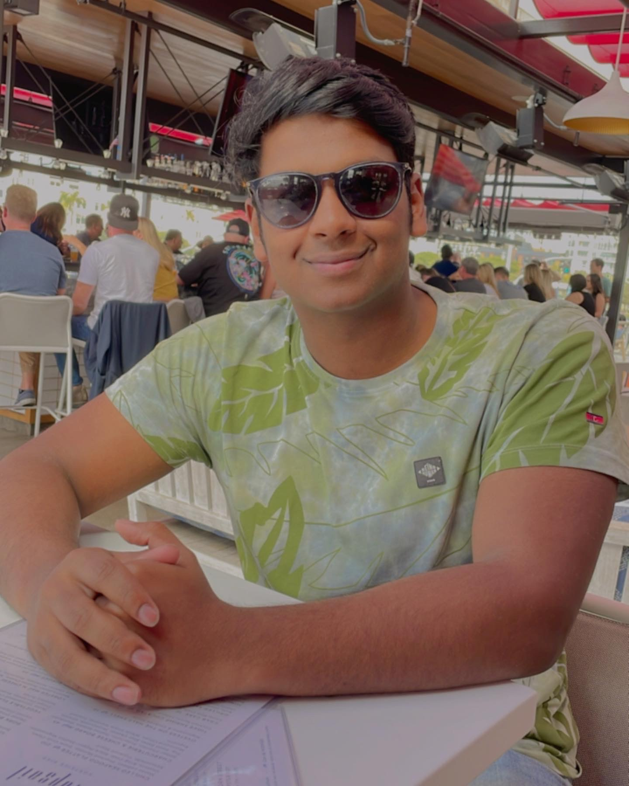

# Welcome to Vivin as a Programmer and as a Person

This site was built using [GitHub Pages](https://pages.github.com/).

**Hi guys this is me, I am Vivin a second year CS major trying to make the most of 110 and kickstart my journey**


 


**Programming allows me to create and innovate**
> 
> Code is like humor. When you have to explain it, it’s bad. – Cory House
> 


Today I reviewed the following git commands, I hope I keep learning more of these:

```
git status
git add
git commit
git checkout 
git push 
```

I also learned how to VS Code UI. Which is super exciting for me as a budding programmer and also why VS Code is my favorite IDE. I started using it for CSE11. I also like using IntelliJ and was informed about its utility at my summer Internship. 

This is the company I interned at: [https://www.radianmobility.com]

[You can find my response to all those people who think CS majors are free tech support here:](mem.jpeg)


Although most of me was covered in the introduction section

## *Here is a little about me outside of coding:*

My favourite things: 
* Classic Rock
* Sailing 
* Squash 
  
[Music](rock.jpeg)  [Sailing](Sailing.jpg.webp)

## *In order of likeliness these are the places you are most likely to find me on campus:*
1. Geisel 
2. Rimac 
3. my room  

My aims for myself as a successful software engineer:
- [ ] Understand the realities of working in a diverse team 
- [ ] Focus more on the iterative process of development than short term results
- [ ] Make mistakes and learn from them 
